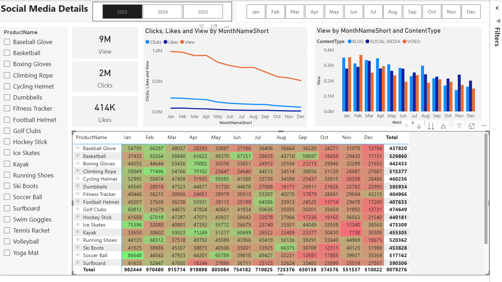

# Marketing Campaign Performance Analysis

## Project Overview

This project analyzes marketing campaign performance, customer engagement, and customer sentiment using SQL, Python, and Power BI. The goal is to transform raw marketing data into actionable insights that support data-driven decision-making.

## Business Problem

Marketing teams need to understand:

* Which campaigns drive the highest engagement
* Which content types perform best
* Customer interaction patterns
* Customer sentiment toward products and services

This project provides insights into marketing effectiveness through data cleaning, sentiment analysis, and interactive reporting.

## Tools Used

* SQL Server
* Python
* Jupyter Notebook
* Power BI

## Project Workflow

### Data Preparation (SQL)

* Cleaned and transformed raw marketing datasets
* Standardized customer and content information
* Prepared data for analysis and reporting

### Sentiment Analysis (Python)

* Processed customer review data
* Performed sentiment analysis
* Generated enriched review datasets

### Dashboard Development (Power BI)

* Built interactive dashboards
* Analyzed campaign performance
* Tracked customer engagement metrics
* Visualized key marketing KPIs

## Repository Structure

* Database → SQL Server backup file
* SQL → Data cleaning and transformation scripts
* Python → Sentiment analysis notebook and processed dataset
* Power BI → Dashboard file
* Images → Dashboard screenshots

## Key Insights

* Identified top-performing marketing campaigns
* Analyzed customer engagement trends
* Evaluated content effectiveness across channels
* Measured customer sentiment from customer reviews
* Generated actionable business recommendations

## Dashboard Preview

### Social Media Details

## Author

**Rudresh Dodke**

Aspiring Data Analyst skilled in SQL, Python, Power BI, and Data Visualization.
